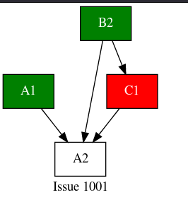

# Gitea Plot Issue Dependencies

A quick and dirty way to **Plot either all connected issues or a specific issue dependencies**.

Requires:

1. GNU Make
1. AWK (probably GNU AWK)
1. Graphviz

## How it works

It uses make as a task runner.

It gets the data from a gitea installation. You may need to edit this
target (gitea-issues.data) in order to make arrangements for your case. 
Currently it tries to reach the gitea MySQL database server through SSH.  If
you have local access or you are using the PostgreSQL database you
need to configure accordingly.

After it downloads gitea-issues.data it tries to create the .dot file. There
is a command line argument that governs if it will plot all connected issues
or the tree of only a specific issue.

See attached screenshots below:




## Legend

* The red issues are blocking other issues.
* The green issues are the closed issues.
* The white issues are normal, non blocking issues.

## Usage

The Makefile accepts the following arguments

* HOST specify to which host to ssh in order to download the data.
* BASE_URL the base_url of your repository so the SVG can hold links. It should end on /issues
* ISSUE if present only the tree of that specific issue will be plotted.

### Examples

To plot the tree of all issue dependencies:

```
make HOST=giteahost BASE_URL=https://giteahost.company.com/git/company/monorepo/issues
```

It results to file gitea-issues.svg

To plot the dependency tree of one specific issue:

```
make HOST=giteahost BASE_URL=https://giteahost.company.com/git/company/monorepo/issues ISSUE=1001
```

It results to file gitea-issue-1001.svg

The resulting SVG can be viewed by the browser by pointing to their direction.
